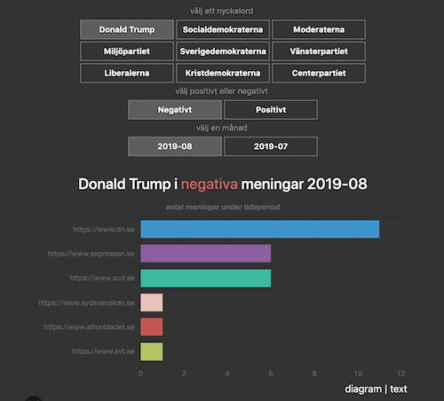
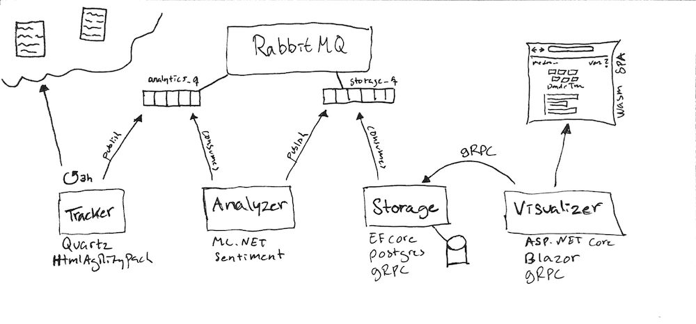

# MediaSpin

## Up and running at
[mediaspin.johanhellgren.se](https://mediaspin.johanhellgren.se)  

## Prerequisites

You need to have the following tech installed locally:

* dotnet core 3.0.x. 
* node 10.x. 
* docker version 18.x. 
* docker-compose version 1.23.x. 

## Start the system

* clone this repo
* run ``npm install`` in /scripts
* run ``node scripts/setup``
* run ``docker-compose up``

## Test
run ``node script/run-all-unit-tests.js``

## Grow the dataset and re-train the model 
First run the system and let tracker execute a full article fetch. Make sure that tracker has the writeArticlesToFile env var set to true. Then navigate to the script folder. In the script folder run     
  
 ``node add-to-dataset-and-re-train-model.js``
 
 (more about the dataset under Challanges below)

## What and why
The idea is to track how Swedish media reports on different subjects by using sentiment analysis. The reason for doing this, besides that I find the idea interesting, is that I had an itch to build something after a couple of months on parental leave. So if you find this solution just a tad over engineered its because I wanted to learn and evaluate some new things as well as revisit some old ideas - and where should you do that if not in a hobby project? =)

## How does it work?

### simplified overview - its a pipeline

**tracker** (tracks and extracts articles containing keywords) =>  
**analyzer** (analyzes sentiment) =>  
**storage** (stores analysis) =>  
**visualizer** (visualizes analysis)

### whiteboard version

## Tech and other stuff in this project
* Kubernetes (yaml files)
* Docker & Docker Compose
* dotnet core 3 (web/service and worker)
* ML.NET
* Sentiment (AFINN-based sentiment analysis for Node.js)
* gRPC
* NodeServices in .net core
* Ef core
* Postgres
* RabbitMQ
* Client side Blazor (WebAssembly) - hence the initial load time :)
* Vue.js (Currently porting the client, see visualizer2)  
* The mediator pattern (without a library)
* CQRS
* Some hexagonal architecture principles in a microservices setting

## Challanges 
I have not been able to find a good Swedish dataset to train my ML.NET model with. So, for now, I am doing the following: 

I am using a Swedish translated AFINN lexicon and word lists I found on Kaggle to generate a dataset from actual articles pulled down by the tracker component.

See /dataset-gen/index.js and scripts/add-to-dataset-and-re-train-model.js and the code in tracker that writes articles to a file to see how this works. 

Its actually working better than I thought it would. But the current model still gets it really wrong sometimes so I am using an AFINN server as a safety net (see analyzer - Engine.cs).
